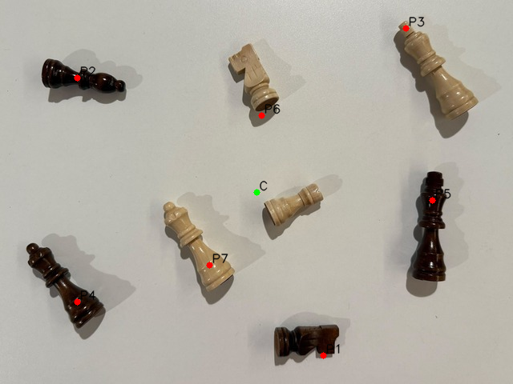
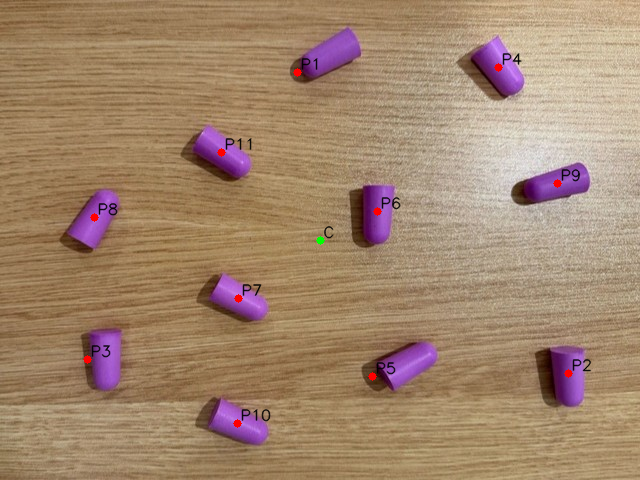

Language Instruction: Please divide the chessmen of different colors into two piles.

You will expect an image for VLM prompting like:
<div align="center">
   
</div>

The target specification is like:

````
To divide the chessmen of different colors into two piles, we will move the light-colored pieces to the right and the dark-colored pieces to the left.
Here is the Python function to specify the final positions of the keypoints:
```python
def keypoint_specification():
   # Move dark-colored pieces to the left
   p1 = [-20, 0, 0]
   p2 = [-20, 0, 0]
   p5 = [-20, 0, 0]
   # Move light-colored pieces to the right
   p3 = [20, 0, 0]
   p6 = [20, 0, 0]
   p7 = [20, 0, 0]
   return p1, p2, p3, p5, p6, p7
```
This function will divide the chessmen of different colors into two piles.
````

---

Language Instruction: Please collect the purple earplugs together.

You will expect an image for VLM prompting like:
<div align="center">
   
</div>

The target specification is like:

````
To collect the purple earplugs together, we can move them to the center of the image. Here is a Python function to specify the final positions of the keypoints:
```python
def keypoint_specification():
    # Move all earplugs to the center
    p2 = [0, 0, 0]
    p3 = [0, 0, 0]
    p4 = [0, 0, 0]
    p6 = [0, 0, 0]
    p7 = [0, 0, 0]
    p8 = [0, 0, 0]
    p9 = [0, 0, 0]
    p10 = [0, 0, 0]
    p11 = [0, 0, 0]
    return p2, p3, p4, p6, p7, p8, p9, p10, p11
```
This function will collect the purple earplugs together.
````
